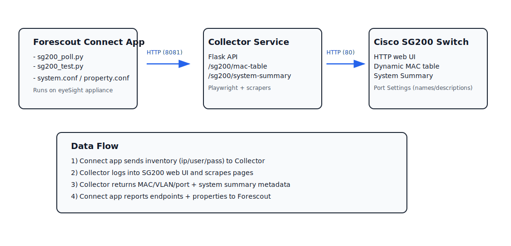

# SG200 Collector + Forescout Connect App SG2XX

This repository contains a **Playwright-based HTTP collector service** and a **Forescout eyeExtend Connect App** bundle. The Connect App calls the collector to inventory supported Cisco switches and enrich endpoint records in the Forescout eyeSight console.

This project is an **as-is community effort**. It is **not supported by Forescout**. It has **not been reviewed or signed by Forescout**. You are responsible for validating security, operational impact, and compatibility in your environment before deploying to production.

Primary outcomes in eyeSight:
- **Switch attribution** for endpoints.
- **Network attachment context**, with **VLAN** and **switch interface name**, mapped into device properties.

## Key capabilities in Forescout eyeSight

- Enriches eyeSight endpoint records with **switch-derived context** for device identification and response workflows.
- Publishes the following as device properties in the eyeSight console:
  - **Switch identity**, including **hostname**, **serial number**, **model**, and **firmware**.
  - **Network attachment context** from the dynamic MAC table, including **VLAN**, **interface name**, and **port_type**.
- Enables Connect-based policies, tags, and automation actions that depend on **interface**, **VLAN**, and **switch identity**.

## Components

- Collector service in **collector.py**, implemented as a Flask app.
- Modular switch scrapers under **scrapers**, implemented as Playwright-based modules.
- Forescout Connect App bundle that calls the collector endpoint **/sg200/poll**.

Collector HTTP endpoints:
- **GET /health**
- **POST /sg200/poll**

  

## System requirements

Windows:
- **Windows 10** or **Windows 11**, or **Windows Server 2019** or later. For Linux/Mac use `python3 -m waitress --listen=0.0.0.0:8080 collector:app` or similar mechanism to launch the collector app.
- **Python 3.10** or later.
- Network reachability from the collector host to the **switch management UI**.

Python packages:
- **flask**
- **waitress**
- **playwright**
- **requests**
- **beautifulsoup4**

Playwright runtime:
- **python -m playwright install chromium**

# Deployment on Windows

Deployment order:
1. Deploy and run the **collector** from the release section ZIP file
2. Test the collector against a switch using **CLI**
3. Download and install the Windows installer for production use from Release section
4. Install and configure the **Forescout Connect App**

## Step 1. Deploy the collector

### 1.1 Extract files

Create directories:
- **C:\SG200Collector\current\**
- **C:\SG200Collector\logs\**

Extract the collector release zip into **C:\SG200Collector\current\** and confirm:
- **collector.py**
- **scrapers** directory

### 1.2 Create virtual environment and install dependencies

Windows PowerShell:

~~~powershell
cd C:\SG200Collector\current
py -m venv venv
.\venv\Scripts\activate
python -m pip install --upgrade pip
pip install flask waitress playwright requests beautifulsoup4
python -m playwright install chromium
~~~

### 1.3 Configure request controls

Create or edit **C:\SG200Collector\current\collector_security.json**.

Example:

~~~json
{
  "allowed_ips": ["192.168.0.45", "192.168.1.201", "192.168.1.200"],
  "token": "test-token"
}
~~~

**allowed_ips** should include the eyeSight appliance addresses that will run Connect polling.  
Clients must send **X-Collector-Token** when **token** is configured.

### 1.4 Run the collector with Waitress

Create a Windows firewall rule for **TCP 8081**.

Windows PowerShell:

~~~powershell
New-NetFirewallRule -DisplayName "SG200 Collector TCP 8081" -Direction Inbound -Action Allow -Protocol TCP -LocalPort 8081
~~~

Start the collector:

~~~powershell
cd C:\SG200Collector\current
.\venv\Scripts\activate
waitress-serve --host=0.0.0.0 --port=8081 collector:app
~~~

Verify reachability:

~~~powershell
curl.exe -fsS "http://127.0.0.1:8081/health"
~~~

Expected response:

~~~json
{"status":"ok"}
~~~

## Step 2. Validate switch communication via CLI

Request body fields:
- **ip** is the switch management IP address.
- **user** is the switch web UI username.
- **pass** is the switch web UI password.

Optional authentication header:
- **X-Collector-Token**

### 2.1 Test switch polling

Windows PowerShell without auth, single line:

~~~powershell
$uri='http://127.0.0.1:8081/sg200/poll';$ip=Read-Host 'IP';$user=Read-Host 'User';$pass=(&{$s=Read-Host 'Pass' -AsSecureString;$p=[Runtime.InteropServices.Marshal]::SecureStringToBSTR($s);try{[Runtime.InteropServices.Marshal]::PtrToStringBSTR($p)}finally{[Runtime.InteropServices.Marshal]::ZeroFreeBSTR($p)}});$body=@{ip=$ip;user=$user;pass=$pass}|ConvertTo-Json -Compress;Invoke-RestMethod -Method Post -Uri $uri -ContentType 'application/json' -Body $body | Format-List -Force
~~~

Windows PowerShell with auth, single line:

~~~powershell
$uri='http://127.0.0.1:8081/sg200/poll';$ip=Read-Host 'IP';$user=Read-Host 'User';$pass=(&{$s=Read-Host 'Pass' -AsSecureString;$p=[Runtime.InteropServices.Marshal]::SecureStringToBSTR($s);try{[Runtime.InteropServices.Marshal]::PtrToStringBSTR($p)}finally{[Runtime.InteropServices.Marshal]::ZeroFreeBSTR($p)}});$tok=(&{$s=Read-Host 'Token' -AsSecureString;$p=[Runtime.InteropServices.Marshal]::SecureStringToBSTR($s);try{[Runtime.InteropServices.Marshal]::PtrToStringBSTR($p)}finally{[Runtime.InteropServices.Marshal]::ZeroFreeBSTR($p)}});$body=@{ip=$ip;user=$user;pass=$pass}|ConvertTo-Json -Compress;$headers=@{'X-Collector-Token'=$tok};Invoke-RestMethod -Method Post -Uri $uri -ContentType 'application/json' -Headers $headers -Body $body | Format-List -Force
~~~

### 2.2 Expected response schema

Successful response shape:

~~~json
{
  "switch_ip": "192.168.1.221",
  "system_summary": {
    "host_name": "GARAGE-SG200",
    "serial_number": "DNI161702F3",
    "firmware_version": "1.1.2.0",
    "model_description": "26-port Gigabit Smart Switch"
  },
  "mac_table": {
    "entries": [
      {
        "mac": "00:0c:29:8d:2f:64",
        "vlan": 1,
        "port_index": "gi25",
        "port_type": "bridge"
      }
    ]
  }
}
~~~

Errors can be present when a component fails:

~~~json
{
  "switch_ip": "192.168.1.221",
  "system_summary": {},
  "mac_table": {
    "entries": []
  },
  "errors": {
    "system_summary": "Unable to collect System Summary after login"
  }
}
~~~

**port_type** is synthetic.  
**device** means one unique MAC was observed on the port in the current snapshot.  
**bridge** means multiple unique MACs were observed on the port in the current snapshot.

If the poll fails with a non-200 status:
- Review **collector console output**.
- Confirm **IP** and **credentials**.
- Confirm network reachability from the collector host to the **switch management UI**.
- Confirm the **Playwright Chromium** runtime is installed.

## Step 3. Production deployment with Windows installer

Install the collector service build as Administrator.  
Place **collector_security.json** in the directory expected by your installer build when you enable allowlist or token checks.  
Restart the collector service after configuration changes.  
Validate using Step 2.

## Step 4. Install and configure the Forescout Connect App

Proceed only after Step 2 succeeds.

### 4.1 Allow unsigned Connect apps Enterprise Manager

Enable unsigned app import:

~~~text
fstool allow_unsigned_connect_app_install true
~~~

**`This is not a Forescout-signed app!!!`**

### 4.2 Import and configure the app

1. Import the Connect App package in the Forescout Console.
2. Configure **Collector Host** and **Collector Port** as **8081**.
3. Configure **Collector Token** when token checks are enabled.
4. Configure up to **16 switches** in the app.
5. Assign eyeSight devices that will run the app.
6. Enable discovery, and set the polling interval to **10 minutes** or longer.
7. Run **Test**, and confirm properties populate in eyeSight.

## Monitoring in production

Tail logs:

~~~powershell
Get-Content "C:\Program Files\SG200Collector\logs\SG200Collector.err.log" -Tail 50 -Wait
~~~
